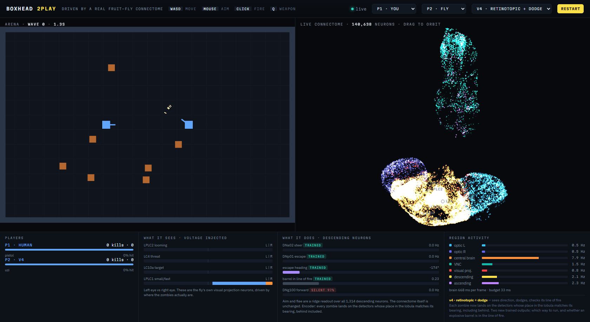
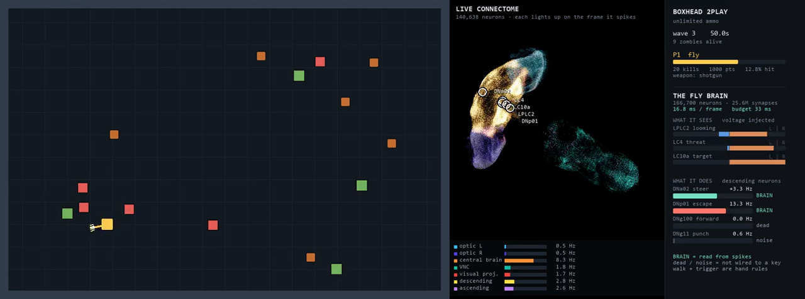

# Fly Brain

A Boxhead-style zombie shooter where one of the players is a real fruit fly.

Not a model of one — the actual wiring diagram. 166,700 neurons and 25,582,938
synapses traced by electron microscopy from a male *Drosophila*, loaded as a
sparse matrix and run as leaky integrate-and-fire units, one step per game
frame. **No weight in that matrix is ever trained.** Everything the fly does in
the game comes out of the shape of wiring that was in a real animal.



Left: the arena. Middle: all 140,638 neurons that have a measured position,
each one lighting up on the frame it spikes. Right: what the fly sees, what its
descending neurons are saying, and how hard each part of its brain is working.

---

## What actually happens each frame

```
game state -> encoder -> 166,700-neuron connectome -> 1,314 descending neurons -> keys
```

Tick-locked: `dt` is set to the game's 33.3 ms and `tonic` is rescaled the way
`flybrain/brain.py` does, so the brain can never fall behind the frame it is
answering. That single detail is what the original fly.ai SSH Fighter
post-mortem blamed for its live results, and it is why this repo puts the game
in Python instead of the browser.

A human wrote exactly two things: the **encoder** (game → voltage on the fly's
own visual projection neurons) and the **decoder** (descending-neuron spikes →
keys). The HUD labels every channel `BRAIN`, `TRAINED` or `HAND` so it is
always clear which is which.

---

## Six versions, measured the same way

Every number below is 12 arenas × 90 s, identical seeds for every version,
solo, unlimited ammo.

| | encoder | readout | escape | barrel check | survived (s) | kills | hit rate |
|---|---|---|---|---|---|---|---|
| **v1** hand-coded | 1 value per eye | 4 named cells | reverse | none | 75.5 ± 18.6 | 33.2 ± 9.8 | 18.7% |
| **v2** trained | 1 value per eye | ridge over 1,314 DNs | reverse | none | 64.2 ± 27.9 | 39.2 ± 20.2 | 22.5% |
| **v3** + DAgger | 1 value per eye | refit on its own states | reverse | none | 82.1 ± 12.2 | 54.3 ± 9.6 | 27.5% |
| **v4** retinotopic | bearing-resolved | + escape + barrel | trained | trained (AUC 0.61) | 59.5 ± 20.7 | 34.2 ± 14.5 | 21.2% |
| **v5** + hand barrel | bearing-resolved | + escape + barrel | trained | geometry | 73.7 ± 19.4 | 41.2 ± 13.3 | 27.6% |
| **v6** new eyes, old legs | bearing-resolved | aim + flee | reverse | geometry | **90.0 ± 0.0** | 39.3 ± 5.3 | **38.1%** |
| _baseline_ 3-rule script | — | — | — | — | 77.0 ± 20.7 | 55.8 ± 16.6 | 58.1% |

Switch between them live from the dropdown in the browser, or
`python play.py --fly v3`.

### What each step taught

**v1 → v2. Reading more neurons helps offline and hurts in the game.**
Only two of the six hand-picked descending channels carry any signal at all
(measured over 3,600 logged frames in `diag.py`):

| channel | cells | measured | wired to a key |
|---|---|---|---|
| DNa02 steering | 1 per side | corr(chase_L, steer_L) **+0.59**, cross term −0.31; right side 64.8% of frames | yes |
| DNp01 escape | 1 per side | 2.98 Hz idle → 8.06 Hz with one zombie closing → 14.21 Hz with three | yes |
| DNg100 forward | 1 per side | silent on 97.2% of frames | no |
| DNg11 punch | 3 per side | \|corr\| < 0.05 against every input | no |
| pIP10 kick | 1 per side | \|corr\| < 0.07 | no |

Fitting a ridge readout over all 1,314 descending neurons lifted side-correct
aim from 66.6% to 78.5% held out — and made the game *worse*, because the
readout was fitted on states a different controller produced.

**v2 → v3. One DAgger round is worth more than any offline metric.**
Let the readout drive, label what it produces, refit. Offline it barely moved
(80.2% → 80.0% side-correct). In the game kills went 39.2 → 54.3 and the fly
drew level with the hand-written script: paired over the same 12 arenas,
survival +5.1 s (t = +0.80), kills −1.4 (t = −0.29).

**v3 → v4. Giving it real direction, and one honest failure.**
Soma positions inside each LC type lie on a 1-D sheet — PC1 carries 70–89% of
the variance — which is that population's place in the retinotopically laid out
lobula. v1–v3 threw that away and collapsed each population to one number per
eye, blind to anything more than 90° off the nose. v4 instead lands every
zombie as a Gaussian bump on the detectors whose place matches its bearing,
covering 13°–167° on both sides. Held-out aim went 80.0% → **84.1%**.

Two new trained outputs were added at the same time. One worked, one did not:

| output | held out | verdict |
|---|---|---|
| flee — is something close | AUC 0.952 | good |
| escape heading | 69.7° mean error (chance is 90°) | weak |
| barrel in line of fire | **AUC 0.608** | near chance, unusable |

The barrel detector failing is not a bug. LPLC1 answers *small object moving
in*; a barrel sits still. There is no circuit in a fly for "explosive barrel",
because no fly has ever needed one.

v4 shipped anyway with the trained barrel gate, and the result is the clearest
number in this repo: **10 of 12 runs took exactly 104 HP of blast damage** —
four barrels × 26 HP — **with 0 contact damage**. The zombies were not killing
it. It was blowing itself up.

**v4 → v5 → v6. Take the two bad parts out, keep the good one.**
v5 replaces the trained barrel gate with three lines of geometry, clearly
labelled `HAND`, and recovers 14 s and 7 kills. v6 also puts escaping back to
the v3 rule and keeps only what measured well: the retinotopic encoder, and the
trained aim and flee readouts.

v6 **survives all twelve runs**, against 8 of 12 for v3 and 7 of 12 for the
script, and its hit rate climbs to 38.1% from v3's 27.5% — the retinotopic
encoder was never the problem, the trained escape heading was. Barrel damage is
0 in eleven of the twelve runs.

It also kills less: 39.3 against v3's 54.3 and the script's 55.8. That is the
price of the barrel rule, which holds fire whenever a barrel sits within
±0.30 rad and 420 px, and with seven barrels on the map that is often. Fewer
shots, each one landing more often, nobody exploding. Whether that is an
improvement depends on whether you are scoring survival or score.

---

## Run it

Needs Python 3.11+, and the connectome itself, which is not in this repo:

```bash
pip install -r requirements.txt
pip install flybrain
flybrain download          # ~260 MB, once, into ~/fly-data
```

Browser (recommended — real WebGL brain you can orbit):

```bash
python server.py           # then open http://127.0.0.1:8770
```

Desktop window:

```bash
python play.py                          # you (P1) vs the fly (P2)
python play.py --p1 fly --p2 none --fly v6
python play.py --p1 script --p2 fly     # baseline vs fly
```

P1 controls: `WASD` move, mouse aim, click or space to fire, `Q` to swap
weapon. Ammo is unlimited for every weapon.



## Reproduce the numbers

```bash
python diag.py 120 9              # which descending channels carry signal
python multibench.py              # script baseline, 12 seeds
python benchtrained.py v3         # any version, 12 seeds
python dagger.py 75               # v2 -> v3: one DAgger round
python learn.py 60                # v4: retinotopic encoder, dodge + barrel targets
```

`learn.py` and `dagger.py` each take roughly 10–15 minutes on a laptop CPU and
overwrite the readout they produce. The shipped `.npz` files are the ones the
table above was measured with, so you only need to retrain if you change the
encoder or the targets.

## Files

| | |
|---|---|
| `game.py` | engine — fixed timestep, no rendering, no input |
| `pilots.py` | `FlyPilot` (both encoders, both decoders), `ScriptPilot`, `HumanPilot` |
| `versions.py` | the six flies above, each pairing an encoder with a readout |
| `play.py` | pygame front end, HUD, mp4 recording |
| `brainview.py` | the live 3D connectome panel for the pygame build |
| `server.py` + `web/index.html` | browser build: aiohttp + websocket, three.js point cloud |
| `diag.py` | logs encoder in / descending out and correlates them |
| `bench.py`, `multibench.py`, `benchtrained.py` | the measurement harness |
| `train.py`, `dagger.py`, `learn.py` | fitting the readouts |
| `ensemble.py` | N copies of one brain voting — untested at scale, see below |
| `readout*.npz` | the fitted linear layers, ~10 MB, enough to play every version |

## Notes for picking this up on another machine

* Nothing here caches the connectome; `~/fly-data/brain.npz` and
  `weights.npz` are downloaded once by `flybrain download`, or point
  `$FLY_DATA` at an existing copy.
* `_propagate` cannot be cached by numba (it closes over large global arrays),
  so the first brain step of every process spends a few seconds compiling. The
  HUD's ms-per-frame figure is high for the first seconds and then settles.
* Brain cost scales with how well it plays: 9–12 ms per frame when it dies at
  wave 3, 16–21 ms when it reaches wave 5, against a 33.3 ms budget. Plan any
  ensemble around that — two copies fit, four do not.
* An encoder and a readout must be paired. A readout fitted on the two-bin
  encoder is reading a different pattern of descending activity than the
  retinotopic one produces. `versions.py` keeps those pairings straight; do not
  mix them by hand.
* Everything is measured with the same 12 seeds
  (`7, 11, 23, 41, 57, 63, 88, 101, 119, 144, 177, 203`). Keep using them or
  the numbers above stop being comparable.

## Open threads

* **DAgger round 2–3 on the v6 readout.** Round 1 was worth 15 kills a run;
  the curve usually flattens around round 3.
* **Escape heading is still weak** at 69.7°. Either it needs its own DAgger
  rounds on states where escaping actually matters, or the descending
  population genuinely does not carry a usable direction and the hand rule is
  the honest answer.
* **Ensemble voting.** fly.ai measured chase going 63% → 72% with eight copies
  voting. `ensemble.py` implements it but has not been benchmarked here,
  because two copies is all the frame budget allows on CPU.
* **The optic lobe is still dead weight.** All 95,501 of its neurons sit at
  0.6–0.8 Hz while the encoder injects straight into the ~720 detector cells.
  Driving the 6,006 photoreceptors instead was measured and the signal does not
  survive the crossing — a bright object anywhere in the field moves LC4,
  LPLC2 and LC10a by less than ±0.1 Hz, and DNp01 stays at exactly 0.00 Hz.
  Making that pathway work is a change to the neuron model, not to this code.

## Credit

* Connectome: **MaleCNS v1.0**, FlyEM / HHMI Janelia, **CC BY 4.0**. Not
  redistributed here.
* Simulator constants and dynamics follow
  [alextitonis/fly.ai](https://github.com/alextitonis/fly.ai) (MIT).
* Game, encoders, readouts and everything in this repo: MIT, see `LICENSE`.
